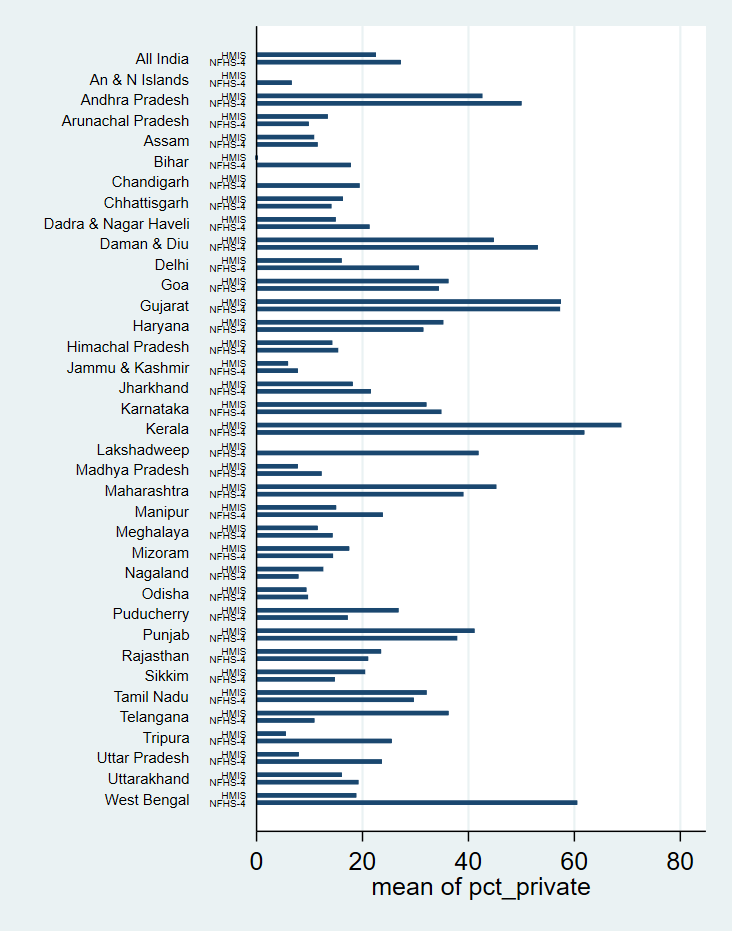

## Bottom Line Up Front

While there is some correspondence between the two sources, I don't think the 2018-2019 HMIS data would be of much value to this line of research. I may be wrong, though! Take a look at the final graphs.

## The Question

Email 1

> The last NFHS was in 2015.  In the decade before, hospital birth increased dramatically from 40% to 80%.  Has it further increased since?  The only data source that *might* help answer this is health monitoring system (HMIS) data from the government.  But we don't know how reliable it is.  If someone cleans and organizes the HMIS data, it could be matched to NFHS-4 data to see whether it reliably reported the proportion of hospital births in different places in 2015.  (It probably did not reliably report deaths.)  If it did, then let's see what it says about the proportion of births that took place in hospitals in 2019 and see if we trust it.

Email 2

> This is substantially going to be a task of assessing data quality -- do these data make any sense?  Do some indicators or states make sense but not others? Whatever you end up learning about it will be useful because I have other colleagues who work on health in India who are interested in it to.  

> I'm also interested in a very specific question: do the numbers on place of delivery (proportion of babies born at home, in public hospitals, and private hospitals) in the HMIS match a high quality sample survey (the NFHS-4)?  

> To get started, I shared a google drive folder that contains HMIS (health monitoring information system) data on maternal and child health.  Here are some steps.  

> Download 2014-2015 data.  

> First figure out whether it seems to be cumulative throughout the year or quarterly data?  One thing that is annoying is that there are a lot of repeat file names which might make working with these spreadsheets more difficult.  

> Once you'd figured the data out a bit, compute the proportion of births it claims occurred in private, public, and at home in each state for 2014-15.  

> Then download and open the NFHS-4.  Look at place of birth (using weights of course) for 2014-15 births.  You'll have to code the place of birth variable yourself based on a wider set of categories, but it should not be too hard.  
 
> Compare the two data sources.  Does the HMIS match the NFHS?  (could you make a graph or a table to show it?)  

> If so, could you please look at what fraction of births happen at home, private, and public in each state in 2018-2019 in the HMIS?  

> If, along the way, you find other interesting things, please let me know.  (One thing is that I think the HMIS basically does not report neonatal mortality.)

## HMIS Data Characteristics

The HMIS data is provided in two explicit levels of aggregation: at the district level and at the sub-district level. For the purpose of investigating the quality of HMIS data compared to NFHS-4 data, we will use the district-level data.

For the year 2014-2015, the data is provided **cumulatively** each quarter. That is, data is available for the periods

* from April 2014 to June 2014 -- the first quarter of Indian fiscal year (FY) 2014-2015 -- in the directory "MonthUpToJune",
* from April 2014 to September 2014 -- the first two quarters of FY 2014-2015 -- in the directory "MonthUpToSeptember",
* from April 2014 to December 2014 -- the first three quarters of FY 2014-2015 -- in the directory "MonthUpToDecember", and
* from April 2014 to March 2015 -- all of FY 2014-2015 -- in the directory "MonthUpToMarch".

Within each of the quarterly directories, there are yet more directories for each of the Indian states containing district- or sub-district-level data. There is also a directory with data aggregated to the state level, which is what we will use for comparison to NFHS-4 data. The file from which we'll extract the data has the following address: "./nrhm_files/district/2014-2015/MonthUpToMarch/_ALL INDIA/All.xls" 

The HMIS reports 166 indicators. The indicator columns are color-coded: white for counts and gray for percentages. Those we care about are called "Number of Home deliveries", "Deliveries Conducted at Public Institutions", "Institutional deliveries (Public Insts.+Pvt. Insts.)", and "Total reported deliveries".

\newpage

## HMIS Results

I find these per-state percentages for place of delivery.

State                | % Home           | % Pub. Inst.    | % Pvt. Inst.
-------------------- | ---------------- | --------------- | ---------------
           All India |       13.12774   |     64.32462    |    22.54765
       A & N Islands |        3.72748   |     96.27252    |     0
      Andhra Pradesh |       5.211907   |     52.16508    |    42.62301
   Arunachal Pradesh |       6.357544   |     80.19682    |    13.44563
               Assam |        15.3392   |     73.79186    |    10.86894
               Bihar |       23.64617   |     76.34688    |     0.0069494
          Chandigarh |       1.447695   |     98.55231    |     0
        Chhattisgarh |       25.80345   |     57.88689    |    16.30967
Dadra & Nagar Haveli |       1.251977   |     83.80338    |    14.94465
         Daman & Diu |       1.574173   |     53.6286     |    44.79723
               Delhi |       6.288519   |     77.64141    |    16.07007
                 Goa |       .1157025   |     63.6584     |    36.22589
             Gujarat |       2.416069   |     40.11806    |    57.46587
             Haryana |       11.37654   |     53.37545    |    35.24801
    Himachal Pradesh |       17.75469   |     67.95181    |    14.2935
     Jammu & Kashmir |       9.073519   |     84.97659    |     5.949898
           Jharkhand |       21.44771   |     60.38848    |    18.16381
           Karnataka |       .9186705   |     67.01209    |    32.06924
              Kerala |       .1705298   |     30.97543    |    68.85404
         Lakshadweep |              0   |    100          |     0
      Madhya Pradesh |       11.51237   |     80.6953     |     7.792329
         Maharashtra |       1.697953   |     53.04405    |    45.258
             Manipur |       20.08797   |     64.88353    |    15.0285
           Meghalaya |        48.5994   |     39.85056    |    11.55005
             Mizoram |       9.637074   |     72.86702    |    17.49591
            Nagaland |       22.89588   |     64.5219     |    12.58222
              Odisha |       11.43811   |     79.14854    |     9.413345
          Puducherry |       .0136509   |     73.18727    |    26.79908
              Punjab |       9.951732   |     48.89772    |    41.15054
           Rajasthan |       5.091767   |     71.39291    |    23.51532
              Sikkim |       2.047952   |     77.46004    |    20.49201
          Tamil Nadu |       .0736521   |     67.82365    |    32.10269
           Telangana |       3.084601   |     60.66509    |    36.25031
             Tripura |       13.15953   |     81.30605    |     5.534418
       Uttar Pradesh |       26.78585   |     65.24159    |     7.972555
         Uttarakhand |       21.66616   |     62.22997    |    16.10387
         West Bengal |       17.51872   |     63.65038    |    18.83089

\newpage

## NFHS-4 Data Characteristics

I downloaded the Births Recode data from the DHS website as linked from the NFHS-4 webpage. It reports 1,315,617 observations of 1,340 variables. Those we care about are called "v005" for overall sample weight, "sv005" for state sample weight, "b3" for the century month code for the date of birth of the child, "m15" for place of delivery, and "v024" for state.

One interesting thing: I've never worked with survey data before, but I would've expected the per-state means of the state sample weights to equal 1 (or 10^6^, since the state sample weight variable contains six decimal places without a decimal point). Instead, the means range from 91% to 113%. The per-state means of state sample weights for those observations with place of birth specified have a similar range.

| State                | Mean State Weight | Mean State Weight, Place Spec |
|----------------------|-------------------|-------------------------------|
| An & N Islands       | 0.9254032         | 0.9254032                     |
| Andhra Pradesh       | 0.97429           | 0.9735988                     |
| Arunachal Pradesh    | 1.024422          | 1.024784                      |
| Assam                | 0.9989088         | 0.9989088                     |
| Bihar                | 1.003095          | 1.002835                      |
| Chandigarh           | 0.9392699         | 0.9392699                     |
| Chhattisgarh         | 1.031145          | 1.031678                      |
| Dadra & Nagar Haveli | 0.9878447         | 0.9878447                     |
| Daman & Diu          | 1.0272            | 1.0272                        |
| Goa                  | 1.030904          | 1.030904                      |
| Gujarat              | 0.9709162         | 0.972153                      |
| Haryana              | 0.9914187         | 0.9914187                     |
| Himachal Pradesh     | 0.9945994         | 0.9945994                     |
| Jammu & Kashmir      | 0.95306           | 0.9529889                     |
| Jharkhand            | 1.018084          | 1.018378                      |
| Karnataka            | 0.9664942         | 0.9669393                     |
| Kerala               | 0.9795464         | 0.9795464                     |
| Lakshadweep          | 0.9709369         | 0.9709369                     |
| Madhya Pradesh       | 0.9896039         | 0.9896706                     |
| Maharashtra          | 0.9448661         | 0.9448661                     |
| Manipur              | 0.9319845         | 0.9319845                     |
| Meghalaya            | 1.015393          | 1.015393                      |
| Mizoram              | 0.9117232         | 0.9115875                     |
| Nagaland             | 0.9574894         | 0.9570939                     |
| Delhi                | 1.132698          | 1.134773                      |
| Odisha               | 0.975834          | 0.9756802                     |
| Puducherry           | 0.9731051         | 0.9731051                     |
| Punjab               | 0.9990199         | 0.9990199                     |
| Rajasthan            | 1.001183          | 1.001247                      |
| Sikkim               | 0.9950843         | 0.9950843                     |
| Tamil Nadu           | 0.9796225         | 0.9796225                     |
| Telangana            | 0.9904967         | 0.9904967                     |
| Tripura              | 0.9897068         | 0.9897068                     |
| Uttar Pradesh        | 0.9916922         | 0.9916922                     |
| Uttarakhand          | 0.999367          | 0.9999779                     |
| West Bengal          | 0.9480488         | 0.9491556                     |

## NFHS-4 Results

Using the weight variables (divided by 10^6^), I find these per-state and all-India percentages for place of delivery for births in 2014-2015.

| State                | % Home | % Other | % Private | % Public |
|----------------------|--------|---------|-----------|----------|
| All India            | 17.97  | 0.26    | 27.24     | 54.53    |
| An & N Islands       | 3.06   | 1.56    | 6.64      | 88.74    |
| Andhra Pradesh       | 5.35   | 0.11    | 50.02     | 44.51    |
| Arunachal Pradesh    | 44.33  | 0.49    | 9.86      | 45.32    |
| Assam                | 25.69  | 0.15    | 11.53     | 62.63    |
| Bihar                | 31.55  | 0.24    | 17.81     | 50.41    |
| Chandigarh           | 4.81   | 0       | 19.45     | 75.74    |
| Chhattisgarh         | 27.6   | 0.06    | 14.13     | 58.22    |
| Dadra & Nagar Haveli | 9.22   | 0       | 21.33     | 69.44    |
| Daman & Diu          | 6.21   | 0       | 53.1      | 40.69    |
| Goa                  | 2.77   | 0       | 34.42     | 62.81    |
| Gujarat              | 8.27   | 0.23    | 57.3      | 34.19    |
| Haryana              | 12.92  | 0.04    | 31.49     | 55.55    |
| Himachal Pradesh     | 20.9   | 0.52    | 15.4      | 63.18    |
| Jammu & Kashmir      | 11.95  | 0.5     | 7.8       | 79.75    |
| Jharkhand            | 33.41  | 0.29    | 21.58     | 44.72    |
| Karnataka            | 3.88   | 0.22    | 34.88     | 61.02    |
| Kerala               | 0      | 0       | 61.88     | 38.12    |
| Lakshadweep          | 0      | 0       | 41.9      | 58.1     |
| Madhya Pradesh       | 16.37  | 0.1     | 12.28     | 71.24    |
| Maharashtra          | 7.55   | 0.25    | 39.04     | 53.17    |
| Manipur              | 28.09  | 0.56    | 23.84     | 47.5     |
| Meghalaya            | 46.43  | 0.38    | 14.36     | 38.83    |
| Mizoram              | 16.96  | 0.42    | 14.44     | 68.18    |
| Nagaland             | 64     | 0.13    | 7.91      | 27.96    |
| Delhi                | 17.86  | 0.23    | 30.67     | 51.23    |
| Odisha               | 13.09  | 0.43    | 9.72      | 76.76    |
| Puducherry           | 0      | 0       | 17.21     | 82.79    |
| Punjab               | 6.06   | 0       | 37.87     | 56.08    |
| Rajasthan            | 13.2   | 0.3     | 21.07     | 65.43    |
| Sikkim               | 2.35   | 0       | 14.78     | 82.87    |
| Tamil Nadu           | 0.57   | 0.07    | 29.69     | 69.67    |
| Telangana            | 19.4   | 0       | 10.92     | 69.68    |
| Tripura              | 28.24  | 0.41    | 25.53     | 45.82    |
| Uttar Pradesh        | 24.02  | 0.47    | 23.66     | 51.85    |
| Uttarakhand          | 19.88  | 0.51    | 19.23     | 60.38    |
| West Bengal          | 4.97   | 0.18    | 60.54     | 34.31    |

## Comparison Plots

Plots comparing the two data sources' accounts of percentage of babies delivered at home, at public institutions, or at private institutions are presented below.

I had to do an unfortunate amount of manual manipulation of the data structures in order to get these plots, which may have introduced some errors.

